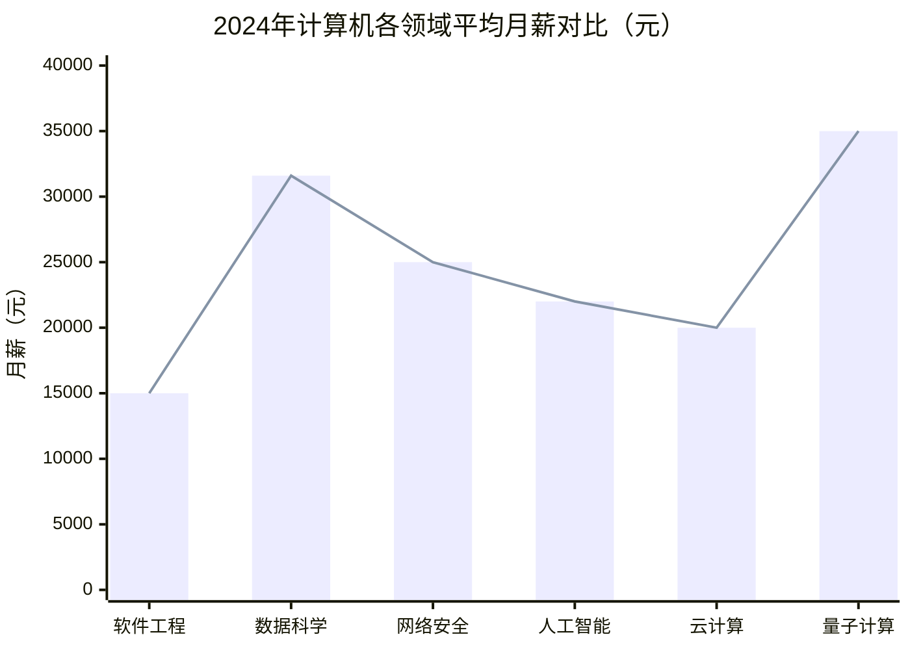
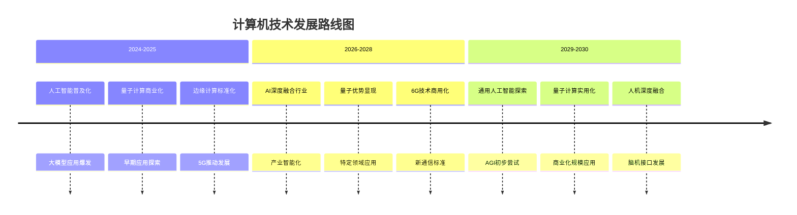

# 计算机行业未来发展分析报告

## 执行摘要

本报告全面分析了计算机行业的未来发展趋势、技术革新方向、就业市场前景，并为计算机专业学生提供了具体的就业选择建议。基于最新市场数据和技术发展预测，计算机行业将继续保持快速增长，特别是在人工智能、量子计算、边缘计算等前沿技术领域。就业市场呈现结构性变化，高端技术人才需求旺盛，但传统岗位竞争加剧。学生需要根据个人兴趣和技能特点，选择合适的技术方向并制定长期的职业发展规划。

## 1. 行业发展趋势分析

### 1.1 市场规模预测

**全球市场前景：**
- 2025年全球计算机工程市场规模预计达到18,000亿元人民币
- 全球云计算机市场总规模预计达到数万亿元人民币
- 网络切片市场规模预计将从2024年的113亿美元增长至2025年的169亿美元

**中国市场表现：**
- 2024年中国计算机市场规模已突破2.5万亿元人民币
- 预计2025年中国计算机市场规模将突破4.2万亿元人民币
- 到2030年电脑市场有望达到4,200亿元人民币

### 1.2 主要发展趋势

**信创产业发展加速：**
- 2025-2026年市场增速分别达到17.84%和26.82%
- 2025年我国信创产业将迎来发展新机遇
- 行业结构持续优化，规模以上企业数量持续增加

**生成式AI双主线发展：**
- 硬件扩容与软件深化同步推进
- 企业通过存货储备、研发投入与生态建设构建竞争壁垒
- 大模型API调用价格持续下降，利好应用侧厂商

## 2. 技术发展深度解析

### 2.1 人工智能与机器学习技术

**技术突破现状：**
- 大模型技术推动生成式AI实现质的飞跃
- 多模态大模型能够同时处理异构数据（时序信息、像素、声波等）
- 智能体技术取得显著进展，67%的数字员工具备自主决策能力

**应用前景：**
- 2025年企业级AI智能体市场规模突破280亿美元
- 中国生成式AI用户已达2.5亿，DeepSeek上线20天日活突破2,000万
- 78%的企业在2024年应用了人工智能技术，较前一年的55%显著增长

### 2.2 量子计算技术

**发展现状：**
- 2025年量子计算商业化落地迎来关键进展
- "天衍-287"超导量子计算机完成搭建，搭载"祖冲之三号"同款芯片
- 玻色量子发布1,000计算量子比特相干光量子计算机
- 微软基于新型材料构造拓扑超导纳米线，实现量子态读取

**未来趋势：**
- 未来5-10年内从实验室走向工业应用
- 在材料科学、药物发现和加密安全领域率先应用
- 量子比特数量和稳定性将持续提升

### 2.3 边缘计算技术

**5G技术驱动发展：**
- 5G边缘计算目标明确：降低延迟，提升数据处理效率
- 全球5G-A边缘计算平台市场规模预计在2025年达到百亿美元级别
- 同比增速超过30%，呈现高速增长态势

**物联网融合应用：**
- 实现分布式架构、实时处理与智能终端协同
- 通过边缘分析实时监测设备运行状况，预测潜在故障
- 云端根据汇总数据进行趋势建模与优化调度

### 2.4 区块链技术

**Web3.0生态发展：**
- Web3.0用户数量持续增长，全球拥有加密货币并使用Web3工具的用户数量庞大
- 新兴市场拥有最高的区块链技术采用率
- 跨链创建的区块链钱包数量众多

**技术架构演进：**
- "分布式+"模式基于区块链分布式系统技术实现
- 结合通证及隐私保护能力，实现去中心化治理
- 将Web2.0中心化的身份、组织、经济、应用管理转变为Web3.0分布式的应用和服务

## 3. 就业市场现状与前景

### 3.1 当前就业市场状况

**整体就业形势：**
- 计算机行业人才需求仍然旺盛，但竞争压力逐渐增大
- 2024年计算机专业就业率有所调整，跌出专业就业率排行榜前五
- 用人单位对计算机专业人才的要求不断提高

**各领域薪资水平：**

### 3.2 未来5-10年就业前景预测

**全球就业变化趋势：**
- 到2030年，全球预计将新增1.7亿个工作岗位，淘汰9,200万个岗位
- 净增长7%，约7,800万个工作岗位
- 22%的就业机会将面临变革

**增长最快的计算机相关职业：**
1. 大数据专家 - 增长率领先
2. 人工智能与机器学习专家 - 高需求增长
3. 软件应用开发人员 - 持续稳定增长
4. 网络安全管理专家 - 安全需求推动增长
5. 数据仓储专家 - 数据驱动增长
6. 物联网专家 - 设备连接需求增长

**中国市场重点发展领域：**
- 低空经济、具身智能、6G技术等新兴领域
- 人工智能、智能网联新能源汽车、智能制造
- 算法工程师等高端技术人才需求持续快速增长

## 4. 不同专业方向就业分析

### 4.1 软件工程专业

**就业优势：**
- 市场需求稳定，各类企业都需要软件开发人才
- 就业选择广泛，跨行业应用性强
- 职业发展路径清晰，从初级开发到架构师
- 薪资水平中上，起薪在7,000-12,000元/月

**主要挑战：**
- 入门门槛相对较低，竞争激烈
- 需要持续学习新技术和框架
- 就业地区集中在一线和新一线城市
- 工作强度较大，项目压力较重

### 4.2 数据科学专业

**就业优势：**
- 高薪资水平，平均年薪约379,483元人民币
- 行业需求旺盛，数字化转型推动岗位增长
- 技术门槛较高，竞争相对较小
- 应用领域广泛，跨行业适用性强

**主要挑战：**
- 技能要求复杂，需要多领域知识
- 企业更看重实际项目经验和业务理解能力
- 需要持续学习新的算法和工具
- 对数学和编程基础要求较高

### 4.3 网络安全专业

**就业优势：**
- 需求持续增长，网络安全威胁增加推动需求
- 薪资增长明显，高端人才稀缺
- 职业稳定性高，是企业刚需
- 技术门槛较高，竞争相对较小

**主要挑战：**
- 需要深入理解安全原理、漏洞分析等专业知识
- 安全责任重大，工作压力较大
- 需要持续学习新的防御技术
- 很多岗位需要相关的专业认证

## 5. 面向学生的就业选择建议

### 5.1 技术方向选择策略

**优先发展领域：**
- **人工智能与大模型**：ChatGPT引发的AI浪潮持续，大模型应用开发需求激增
- **云原生技术**：容器化、微服务、Serverless成为主流技术方向
- **数据智能**：企业数字化转型带动数据分析、BI岗位增长
- **信息安全**：网络安全法规趋严，安全人才缺口大
- **Web3与区块链**：去中心化应用、DeFi、NFT等新兴领域

**技术发展路线图：**

### 5.2 企业类型选择指南

**互联网大厂（BAT、字节等）：**
- 优势：薪资高、福利好、技术先进
- 挑战：竞争激烈、工作强度大
- 适合：技术能力强、能承受高压的毕业生

**独角兽/创业公司：**
- 优势：成长快、期权多、扁平化管理
- 挑战：稳定性较低、风险较高
- 适合：喜欢挑战、追求快速成长的毕业生

**外企：**
- 优势：Work-Life Balance好、技术视野国际化
- 挑战：晋升速度可能较慢
- 适合：注重生活质量、英语能力强的毕业生

**金融科技/银行IT：**
- 优势：稳定、福利好、薪资可观
- 挑战：技术创新可能较保守
- 适合：追求稳定、对金融感兴趣的毕业生

**国企/事业单位：**
- 优势：极度稳定、压力小、福利保障好
- 挑战：薪资增长慢、技术更新慢
- 适合：追求工作生活平衡、注重稳定的毕业生

### 5.3 城市选择策略

**一线城市（北京/上海/深圳）：**
- 机会多、薪资高、技术氛围浓厚
- 生活成本高、竞争激烈
- 适合：追求职业快速发展、能承受高压的毕业生

**新一线城市（杭州/成都/武汉等）：**
- 发展机会较多、生活成本适中
- 技术生态逐渐完善
- 适合：平衡职业发展与生活质量的毕业生

**二线城市：**
- 生活成本低、竞争压力小
- 职业天花板较低、技术机会相对少
- 适合：注重生活质量、家庭因素重要的毕业生

### 5.4 职业发展规划

**技术发展路线（Individual Contributor）：**
- **初级工程师（0-2年）**：快速成长，打好基础，掌握主语言和开发工具
- **中级工程师（2-4年）**：技术深度与广度兼修，能独立负责中型项目
- **高级工程师（4-7年）**：成为技术专家，具备架构能力
- **资深专家/架构师（7年以上）**：技术领导力，战略视野

**管理发展路线（People Manager）：**
- **Team Leader（3-5年）**：团队日常管理，技术方案评审
- **技术经理（5-8年）**：团队建设、技术规划
- **技术总监（8年以上）**：技术战略规划，组织架构设计
- **CTO（10年以上）**：公司技术战略，技术团队建设

### 5.5 能力建设与提升

**核心能力培养：**
- **技术能力**：编程基础（数据结构、算法、计算机基础）、专业技能（根据方向深耕）
- **软技能**：沟通能力、产品思维、项目管理、商业意识
- **英语能力**：技术文档阅读、国际交流合作

**学习资源推荐：**
- 在线课程：极客时间、Coursera、edX
- 技术社区：GitHub、Stack Overflow、CSDN
- 书籍推荐：《代码大全》《设计数据密集型应用》《算法导论》

**实践机会获取：**
- 参与开源项目，积累实际开发经验
- 实习经历，了解企业实际工作流程
- 技术竞赛，提升解决问题能力
- 个人项目，展示技术能力和创造力

## 6. 结论与展望

计算机行业正处在前所未有的技术变革时期，人工智能、量子计算、边缘计算等新兴技术正在重塑行业格局。未来5-10年，行业将继续保持快速增长，但就业市场将呈现结构性变化。

**对学生的发展建议：**
1. **尽早确定技术方向**，选择符合个人兴趣和市场需求的专业领域
2. **注重基础能力建设**，扎实的计算机基础是长期发展的根本
3. **保持持续学习态度**，技术更新快速，需要不断学习新知识
4. **积累实践经验**，通过项目实践提升实际工作能力
5. **培养综合素养**，技术能力与软技能并重发展

**行业展望：**
- 人工智能技术将继续深入各行业应用，创造新的就业机会
- 量子计算等前沿技术将从实验室走向实际应用
- 跨领域复合型人才将成为市场稀缺资源
- 技术发展将更加注重伦理和社会责任

计算机行业为毕业生提供了广阔的发展空间和职业机会，但也面临着激烈的竞争和快速的技术变革。学生需要根据自身情况制定合理的职业规划，在不断学习成长中把握行业发展机遇。

---
*本报告基于2024-2025年最新市场数据和技术发展趋势分析编制，仅供参考。实际发展可能受多种因素影响，建议持续关注行业动态并调整发展规划。*